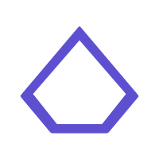

# KcalbApp brand assets

&nbsp;
&nbsp;

Official logo files for **KcalbApp** — *Create · Connect · Evolve* — [kcalb-ltd.com](https://kcalb-ltd.com).
KcalbApp is a brand of [Kcalb Ltd](https://kcalb-ltd.com), part of the KcalbApp ecosystem.

## Choose an asset

| You need | Use |
|---|---|
| App icon, profile picture, favicon | [`assets/png/square/`](assets/png/square/) — 32, 200, 500, 1024, 3000 px |
| Round avatar, wallet or token list | [`assets/png/round/`](assets/png/round/) — 32, 200, 500, 1024, 3000 px |
| Symbol on a dark or colored background | [`assets/png/symbol-white/`](assets/png/symbol-white/) |
| Symbol on a white or light background | [`assets/png/symbol-color/`](assets/png/symbol-color/) |
| App icon on the stores, Discord server icon | [`assets/png/app-icon/`](assets/png/app-icon/) — 200, 500, 1024 px |
| Print, large formats, any other size | [`assets/svg/`](assets/svg/) — vector masters |

Every PNG is rendered from the SVG masters. Use the SVG whenever the platform accepts it, otherwise the smallest PNG that is at least as large as the display size on a high-density screen.

Direct links, for integrations: `https://raw.githubusercontent.com/Kcalb-Ltd/kcalbapp-brand/main/assets/png/round/kcalbapp-round-500.png`. For production, pin a commit hash instead of `main` and check the file against [asset-manifest.json](asset-manifest.json).

## Official colors

| Color | Hex | Use |
|---|---|---|
| KcalbApp | `#5E4FD1` | background of the icon, symbol on light backgrounds |
| Shadow | `#272158` | drop shadow under the symbol only |
| White | `#FFFFFF` | symbol on the brand color or on dark backgrounds |
| App icon | `#21003C` to `#8A44D8` | deep violet background of the app icon only |

The icon is a flat brand color with a white symbol and a soft drop shadow toward the lower right. The mark itself never uses gradients. The app icon is the one exception: the same white symbol on a deep violet background with a soft glow.

Updated 26 September 2026: the pentagon keeps its shape with a thinner stroke, and the app icon is added.

## Usage rules

- Use the files as provided. Do not redraw, recolor, stretch, rotate, crop or outline the symbol, and do not add effects.
- Keep the symbol centered in its square or circle, and keep clear space around the icon.
- On a white background, use the square or round icon, or the colored symbol. On a dark background, use the icon or the white symbol.
- Do not place the artwork next to another mark in a way that suggests partnership or endorsement.
- Refer to the brand as **KcalbApp**, with this exact spelling.

## Integrity

`asset-manifest.json` lists every file with its size and SHA-256 hash. The *Asset integrity* check runs `scripts/verify-assets.py` on every change and fails if any file is added, removed or altered without updating the manifest.

## Email signature

[`assets/email-signature/`](assets/email-signature/) holds the eleven slices of the Kcalb Ltd email signature banner, at twice the display size for high-density screens. Each brand icon is a separate image so that it can link to its own website.

## The Kcalb Ltd brand family

| Brand | Assets | Website |
|---|---|---|
| InoPulse | [`Kcalb-Ltd/inopulse-brand`](https://github.com/Kcalb-Ltd/inopulse-brand) | [inopulse.org](https://inopulse.org) |
| Crypto-Only | [`Kcalb-Ltd/crypto-only-brand`](https://github.com/Kcalb-Ltd/crypto-only-brand) | [crypto-only.org](https://crypto-only.org) |
| KcalbApp | [`Kcalb-Ltd/kcalbapp-brand`](https://github.com/Kcalb-Ltd/kcalbapp-brand) | [kcalb-ltd.com](https://kcalb-ltd.com) |
| StakeHolDrop | [`Kcalb-Ltd/stakeholdrop-brand`](https://github.com/Kcalb-Ltd/stakeholdrop-brand) | [stakeholdrop.com](https://stakeholdrop.com) |
| InoAi | [`Kcalb-Ltd/inoai-brand`](https://github.com/Kcalb-Ltd/inoai-brand) | [inoai.org](https://inoai.org) |
| InoSwap | [`Kcalb-Ltd/inoswap-brand`](https://github.com/Kcalb-Ltd/inoswap-brand) | [inoswap.org](https://inoswap.org) |
| InoPlace | [`Kcalb-Ltd/inoplace-brand`](https://github.com/Kcalb-Ltd/inoplace-brand) | [inoplace.org](https://inoplace.org) |
| Kcanther | [`Kcalb-Ltd/kcanther-brand`](https://github.com/Kcalb-Ltd/kcanther-brand) | [kcanther.org](https://kcanther.org) |
| Xitcoin | [`Xitcoin-org/brand`](https://github.com/Xitcoin-org/brand) | [xitcoin.org](https://xitcoin.org) |
| InoShop | [`Kcalb-Ltd/inoshop-brand`](https://github.com/Kcalb-Ltd/inoshop-brand) | [inoshop.org](https://inoshop.org) |

## License and contact

Copyright © 2026 Kcalb Ltd. All rights reserved — the [LICENSE](LICENSE) allows use of the unmodified files to refer to KcalbApp.
Questions and requests: **contact@kcalb-ltd.com**, or open an [issue](https://github.com/Kcalb-Ltd/kcalbapp-brand/issues).
